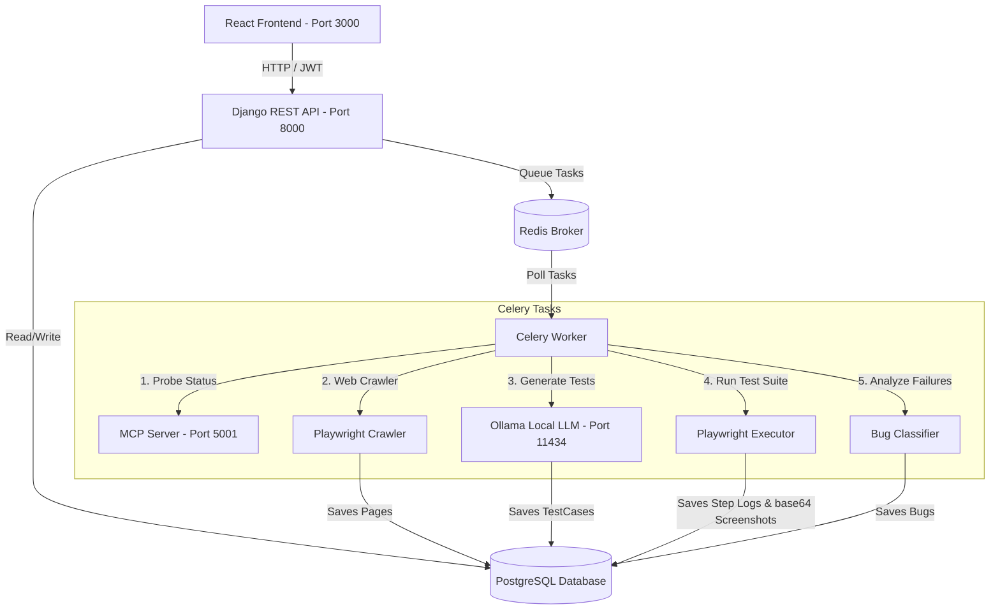

# ⚡ QA Engineer MVP Platform

QA Engineer MVP is an intelligent, self-hosted autonomous Quality Assurance platform. Developers can input any target website URL, and the platform automatically discovers its pages and forms, generates AI-driven test suites (using a local Ollama server, or robust deterministic templates if offline), executes the test steps inside automated browser instances (via Playwright), classifies step errors into severe bugs, and streams results in real-time to a premium dark-mode React dashboard.

---

## 🏗️ Architecture Overview

The application is split into a decoupled Backend API + Celery Worker architecture, and a Single Page React application.



---

## 🗄️ Database Schema Diagram

The database uses a clean, relational PostgreSQL layout:

- **Users**: Standard Django authentication table (`auth_user`).
- **Applications**: Registered testing sites. Stores target URLs, status, and optional login credentials.
- **Pages**: Extracted subpages. Stores URLs, titles, detected `<form>` configurations, and `<button>` selectors in JSON fields.
- **TestCases**: AI or template-driven test scenarios. Stores JSON action arrays representing execution steps.
- **TestRuns**: Instances of test suite runs. Tracks execution state (COMPLETED, FAILED, RUNNING) and bug counts.
- **TestResults**: Step-by-step logs for a `TestRun`. Stores pass/fail flags, error traces, and Base64 screenshot strings.
- **Bugs**: Defect tickets. Stores error summaries and classified severity rankings.

---

## 🚀 Getting Started (Installation & Running)

You can run the application either **locally on your machine** (using local servers or a hybrid Docker configuration) or entirely via **Docker Compose** (one-click deployment).

---

### Option A: Running Locally (Recommended for Development)

#### 1. Prerequisites
- **Python**: version 3.10+
- **Node.js**: version 18+
- **Redis**: running locally on port `6379`
- **PostgreSQL**: running locally on port `5432` with a database named `qa_ai_platform`
- **Ollama (Optional)**: running locally with `ollama run qwen2.5:7b` (or another supported model)

> [!TIP]
> **Hybrid Setup (Easiest Local Development)**: If you do not want to install PostgreSQL and Redis directly on your host machine, you can run only the database and broker in lightweight Docker containers by executing:
> ```bash
> docker compose up -d postgres redis
> ```
> This starts PostgreSQL and Redis on ports `5432` and `6379` automatically with the default credentials, allowing you to run the Django API and React dev server locally.

#### 2. Setup Environment Files
1. Copy the environment template in the root directory:
   ```bash
   cp .env.example .env
   ```
   Open the root `.env` and fill in your settings. Default credentials:
   - `DB_NAME=qa_ai_platform`
   - `DB_USER=postgres`
   - `DB_PASSWORD=root`
   - `DB_HOST=localhost`
   - `DB_PORT=5432`

2. Copy the frontend environment template:
   ```bash
   cp frontend/.env.example frontend/.env
   ```

#### 3. Backend Setup
Open a new terminal window:
```bash
cd backend
python -m venv venv

# On Windows (PowerShell):
.\venv\Scripts\activate
# On Mac/Linux:
source venv/bin/activate

pip install -r requirements.txt
playwright install chromium

# Run migrations and start server
python manage.py migrate
python manage.py runserver
```
The Django REST API will now be active at `http://localhost:8000`.

#### 4. Celery Worker Setup
Open a new terminal window:
```bash
cd backend
# Activate your virtual environment
.\venv\Scripts\activate

# On Windows (force solo execution pool to prevent multiprocessing crashes):
celery -A qa_engine worker -l info -P solo

# On Mac/Linux:
celery -A qa_engine worker -l info -P threads --concurrency=2 -Q discovery,execution,quality,celery

```
If you ever need to purge the task queue or flush Redis database due to stalled tasks:
```bash
# Purge Celery queues
celery -A qa_engine purge -f

# Flush Redis broker databases
python manage.py shell -c "import django; django.setup(); from django.conf import settings; import redis; r = redis.Redis.from_url(settings.CELERY_BROKER_URL); print('Flushed Redis:', r.flushdb())"
```

#### 5. Frontend Setup
Open a new terminal window:
```bash
cd frontend
npm install
npm run dev
```
Open `http://localhost:3000` in your web browser.

---

### Option B: Running with Docker (One-Click Deploy)

This project provides a complete, multi-container Docker environment. We support **Development Mode** (with code mounting, hot-reloading, and exposed debug ports) and **Production Mode** (with optimized static assets served by Nginx and resource constraints).

#### 1. Prerequisites
- **Docker** and **Docker Compose** installed (Docker Desktop for Windows/macOS).
- Local **Ollama** running on your host (if using AI test generation) and configured to accept external connections:
  - **macOS/Linux**: `OLLAMA_HOST=0.0.0.0 ollama serve`
  - **Windows**: Add an Environment Variable `OLLAMA_HOST` set to `0.0.0.0`, restart Ollama, and restart your terminal.

#### 2. Configuration Setup
1. Copy `.env.example` to `.env` in the root:
   ```bash
   cp .env.example .env
   ```
2. Adjust environment variables in `.env` if necessary. The defaults work out-of-the-box with the Docker Compose service names.

#### 3. Development Mode (with Hot Reloading)
This setup mounts the source directories (`./backend` and `./frontend`) into the containers, enabling live backend reload and frontend Vite hot module replacement (HMR).
```bash
docker compose -f docker-compose.yml -f docker-compose.dev.yml up --build
```
- **Accessing the Application**:
  - Main Gateway (Nginx Proxy): [http://localhost](http://localhost) (Proxies `/` to Vite dev server and `/api` to Django)
  - Direct Frontend (Vite): [http://localhost:3000](http://localhost:3000)
  - Direct Backend API (Django): [http://localhost:8000/admin/](http://localhost:8000/admin/)
  - Database (Postgres): `localhost:5432`
  - Cache/Broker (Redis): `localhost:6379`

#### 4. Production Mode (Optimized & Secure)
This setup compiles the React frontend to highly optimized static assets served directly by Nginx. The Django API runs under Uvicorn with resource limits and no developer ports exposed to the host OS.
```bash
docker compose -f docker-compose.yml -f docker-compose.prod.yml up -d --build
```
- **Accessing the Application**:
  - The application is exposed exclusively on Port 80: [http://localhost](http://localhost)
  - Admin Panel: [http://localhost/admin/](http://localhost/admin/)
  - API Health Check: [http://localhost/api/health/](http://localhost/api/health/)

#### 5. Useful Docker Commands
- **Run migrations manually** (although they run automatically on backend startup):
  ```bash
  docker compose exec backend python manage.py migrate
  ```
- **Create a Django Superuser**:
  ```bash
  docker compose exec -it backend python manage.py createsuperuser
  ```
- **View logs for all services**:
  ```bash
  docker compose logs -f
  ```
- **Stop all services**:
  ```bash
  docker compose down
  ```
- **Stop and remove all volumes (WARNING: deletes DB and Redis data)**:
  ```bash
  docker compose down -v
  ```

---

## 📡 API Endpoint Documentation

### Authentication
* **POST** `/api/auth/register/` - Create a user profile. Returns token credentials.
* **POST** `/api/auth/login/` - Validate credentials. Returns JWT access/refresh tokens.

### Applications
* **GET** `/api/applications/` - List all registered applications.
* **POST** `/api/applications/` - Register a new application URL.
* **GET** `/api/applications/{id}/` - Retrieve details of a registered application.
* **POST** `/api/applications/{id}/discover/` - Trigger the page/form discovery worker.
* **GET** `/api/applications/{id}/pages/` - Retrieve all discovered subpages and structural elements.
* **GET** `/api/applications/{id}/status/` - Retrieve live crawling status.

### Test Cases
* **GET** `/api/test-cases/` - List all test cases.
* **POST** `/api/test-cases/generate/` - Request AI generation for `app_id`.
* **GET** `/api/test-cases/{id}/` - Retrieve steps for a test case.

### Test Runs (Execution)
* **GET** `/api/test-runs/` - List execution histories.
* **POST** `/api/test-runs/execute/` - Execute browser automation for `test_case_id`.
* **GET** `/api/test-runs/{id}/` - Fetch step logs and screenshot data.
* **GET** `/api/test-runs/{id}/status/` - Retrieve live runner completion metrics.

### Bug Tracking
* **GET** `/api/bugs/` - List all logged bugs.
* **GET** `/api/bugs/{id}/` - Retrieve bug reproduction description and severity.

---

## 🛠️ Troubleshooting Guide

### 1. Celery Tasks Stalled in "PENDING"
* **Cause**: The Celery worker is not running, or Redis is offline.
* **Fix**: Ensure Redis is running on port 6379 (`redis-cli ping` should return `PONG`). Start the worker using `celery -A qa_engine worker -l info -P solo` (or standard commands on Mac/Linux) and verify it joins successfully.

### 2. Playwright Crashes on Docker Compose
* **Cause**: Container OS lacks libraries required to execute chromium headless.
* **Fix**: The provided `./backend/Dockerfile` runs `playwright install --with-deps chromium` during build. Rebuild the container using `docker compose build --no-cache` to ensure all OS-level packages are populated.

### 3. No Test Cases Generated (Empty Test Suite)
* **Cause**: Ollama is not active or hasn't loaded the requested model.
* **Fix**: Check if Ollama is running (`curl http://localhost:11434`). The system has a built-in safety net: if Ollama is unreachable, it automatically triggers a **Deterministic Fallback Suite** generating form submissions and page checkups, so the testing pipeline remains active.

### 4. Playwright Timeout Failures
* **Cause**: The target website loads slow, or elements are rendering via dynamic JS animations past the action threshold.
* **Fix**: Adjust default step timeout thresholds in `backend/tasks/execution.py` or add a `wait` step (duration in milliseconds) inside your test case sequence.
